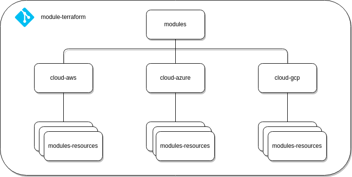

# Terraform Modules

## 

## 

## Example

```bash
├── modules
│   ├── cloud-aws
│   │   └── README.md
│   ├── cloud-azure
│   │   ├── network
│   │   │   ├── subnet
│   │   │   │   ├── examples
│   │   │   │   │   ├── complete
│   │   │   │   │   │   ├── main.tf
│   │   │   │   │   │   ├── outputs.tf
│   │   │   │   │   │   ├── README.md
│   │   │   │   │   │   ├── variables.tf
│   │   │   │   │   │   └── versions.tf
│   │   │   │   │   └── simple
│   │   │   │   │       ├── main.tf
│   │   │   │   │       ├── outputs.tf
│   │   │   │   │       ├── README.md
│   │   │   │   │       ├── variables.tf
│   │   │   │   │       └── versions.tf
│   │   │   │   ├── LICENSE
│   │   │   │   ├── main.tf
│   │   │   │   ├── output.tf
│   │   │   │   ├── README.md
│   │   │   │   ├── variables.tf
│   │   │   │   └── version.tf
│   │   │   └── vnet
│   │   │       ├── examples
│   │   │       │   ├── complete
│   │   │       │   │   ├── main.tf
│   │   │       │   │   ├── outputs.tf
│   │   │       │   │   ├── README.md
│   │   │       │   │   ├── variables.tf
│   │   │       │   │   └── versions.tf
│   │   │       │   └── simple
│   │   │       │       ├── main.tf
│   │   │       │       ├── outputs.tf
│   │   │       │       ├── README.md
│   │   │       │       ├── variables.tf
│   │   │       │       └── versions.tf
│   │   │       ├── LICENSE
│   │   │       ├── main.tf
│   │   │       ├── output.tf
│   │   │       ├── README.md
│   │   │       ├── variables.tf
│   │   │       └── version.tf
│   │   ├── resource-group
│   │   │   ├── examples
│   │   │   │   ├── complete
│   │   │   │   │   ├── main.tf
│   │   │   │   │   ├── outputs.tf
│   │   │   │   │   ├── README.md
│   │   │   │   │   ├── variables.tf
│   │   │   │   │   └── versions.tf
│   │   │   │   └── simple
│   │   │   │       ├── main.tf
│   │   │   │       ├── outputs.tf
│   │   │   │       ├── README.md
│   │   │   │       ├── variables.tf
│   │   │   │       └── versions.tf
│   │   │   ├── LICENSE
│   │   │   ├── main.tf
│   │   │   ├── outputs.tf
│   │   │   ├── README.md
│   │   │   ├── variables.tf
│   │   │   └── version.tf
│   │
│   └── cloud-gcp
└──       └── README.md
```

## Creating Modules

Hands-on: Try the [Reuse Configuration with Modules](https://developer.hashicorp.com/terraform/tutorials/modules?utm_source=WEBSITE&utm_medium=WEB_IO&utm_offer=ARTICLE_PAGE&utm_content=DOCS) tutorials.

## Generic Git Repository

Arbitrary Git repositories can be used by prefixing the address with the special git:: prefix. After this prefix, any valid Git URL can be specified to select one of the protocols supported by Git.

For example, to use HTTPS or SSH:

```hcl
module "vpc" {
  source = "git::https://example.com/vpc.git"
}

module "storage" {
  source = "git::ssh://username@example.com/storage.git"
}
```

Terraform installs modules from Git repositories by running git clone, and so it will respect any local Git configuration set on your system, including credentials. To access a non-public Git repository, configure Git with suitable credentials for that repository.

If you use the SSH protocol then any configured SSH keys will be used automatically. This is the most common way to access non-public Git repositories from automated systems because it allows access to private repositories without interactive prompts.

If using the HTTP/HTTPS protocol, or any other protocol that uses username/password credentials, configure [Git Credentials Storage](https://git-scm.com/book/en/v2/Git-Tools-Credential-Storage) to select a suitable source of credentials for your environment.

## Modules in Package Sub-directories

When the source of a module is a version control repository or archive file (generically, a "package"), the module itself may be in a sub-directory relative to the root of the package.

A special double-slash syntax is interpreted by Terraform to indicate that the remaining path after that point is a sub-directory within the package. For example:

- hashicorp/consul/aws//modules/consul-cluster
- git::https://example.com/network.git//modules/vpc
- https://example.com/network-module.zip//modules/vpc
- s3::https://s3-eu-west-1.amazonaws.com/examplecorp-terraform-modules/network.zip//modules/vpc

If the source address has arguments, such as the ref argument supported for the version control sources, the sub-directory portion must be before those arguments:

- git::https://example.com/network.git//modules/vpc?ref=v1.2.0
- github.com/hashicorp/example//modules/vpc?ref=v1.2.0

Terraform will still extract the entire package to local disk, but will read the module from the subdirectory. As a result, it is safe for a module in a sub-directory of a package to use a local path to another module as long as it is in the same package.
